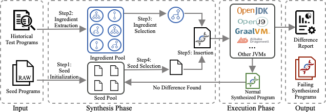
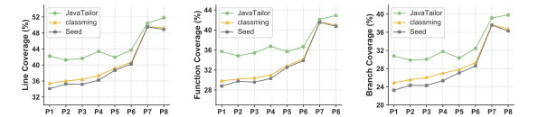

### CFSynthesis

This is the implementation of our ICSE 2022 paper: History-Driven Test Program Synthesis for JVM Testing.

### I. Introduction

In this work, we propose JavaTailor, a history-driven test program synthesis technique, which synthesizes diverse test programs by weaving the ingredients extracted from JVM historical test programs into seed programs for covering more JVM behaviors/paths. 

The overview of JavaTailor is shown below, which consists of two main phase: the Synthesis Phase and the Execution Phase. The input of JavaTailor is historical test programs and seed programs.  The output is the difference report of JVMs behaviors and the corresponding synthesized program that expose these differences.



<p align="center">Figure 1: Overview of JavaTailor</p>

Experimental results on popular JVM implementations (i.e., HotSpot and OpenJ9) show that JavaTailor outperforms the state-of-the-art technique in generating more diverse and effective test programs, e.g., test programs generated by JavaTailor can achieve higher JVM code coverage and detect many more unique inconsistencies than the state-of-the-art technique. 

For example, Figure 2 shows the coverage comparison results, where the gray lines present the coverage achieved by the seed programs, and the green and yellow lines present the coverage achieved by JavaTailor and classming on the basis of the seed programs respectively.


<p align="center">Figure 2: JVM code coverage comparison</p>


### II. Getting Started

##### (1) Import as an maven project

JavaTailor is developed as an maven project, so to configure and run JavaTailor, you can import it dierctly into your IntelliJ IDEA workspace as a maven project.  

##### (2) import test subjects

The directory of these test subjects can be set in the code. However,  JavaTailor has specific requirements for teh directory format of test subejcts. Please place your test subjects in the following format.

```markdown
├── 01JVMS
│   ├── Windows
│   ├── linux64
│   └── macOSx64
│       ├── openjdk11
│       │   ├── OpenJDK11U-jre_x64_mac_hotspot_11.0.11_9
│       │   │   └── Contents/*
│       │   ├── OpenJDK11U-jre_x64_mac_openj9_11.0.11_9_openj9-0.26.0
│       │   │   └── Contents/*
│       └── openjdk8
│           ├── OpenJDK8U-jre_x64_mac_hotspot_8u292b10
│           │   └── Contents*
│           ├── OpenJDK8U-jre_x64_mac_openj9_8u292b10_openj9-0.26.0
│           │   └── Contents/*
└── 
```

##### (3) create sootOuput directory

Create **sootOuput** directory and copy  all items under **02Benchmarks** to **sootOuput**

##### (4) test

a. To have a preview of all test subjects and benchmarks, execute **Preview** under **Main/src/main/java**. If all your settings are correct, the output of preview should be like：

```
================================================== Testing Platform Information ==================================================
     os name: mac os x
  os version: 10.16
   java home: yourpath/adopt-openjdk-1.8.0_292/Contents/Home/jre
java version: 1.8.0_292
==================================================================================================================================
================================================== JVM Implementation ==================================================
JVM root path: ./01JVMS/macOSx64/openjdk8
  JVM Version: OpenJDK8U-jre_x64_mac_hotspot_8u292b10
     Java Cmd: yourpath/01JVMS/macOSx64/openjdk8/OpenJDK8U-jre_x64_mac_hotspot_8u292b10/Contents/Home/bin/java
========================================================================================================================
================================================== Project Information ==================================================
Project Path: yourpath/02Benchmarks/HotspotTests-Java
Project Name: HotspotTests-Java
         lib: yourpath/02Benchmarks/HotspotTests-Java/lib
         src: yourpath/02Benchmarks/HotspotTests-Java/src
   total src: 8856
        test: null
  total test: 0
   src class: yourpath/02Benchmarks/HotspotTests-Java/out/production/HotspotTests-Java
  test class: null
 applicaiton: 3986/12134
 junit class: 26/0
=========================================================================================================================
```

b. To test a target project, set the following parameters:

```java
//set target project name
public static String projectName = "HotspotTests-Java";
//set test subjects path
DTConfiguration.setJvmDepensRoot("." + DTPlatform.FILE_SEPARATOR + "01JVMS");
//set sootOutput path
DTConfiguration.setProjectDepensRoot("." + DTPlatform.FILE_SEPARATOR + "sootOutput");
```

##### (5) Directory description

```markdown
├── 01JVMS					:  test subjects
├── 02Benchmarks			:  origin benchmarks
├── 03results				:  difference report
├── 04SynthesisHistory		:  programs generated during synthsizing 
├── DTJVM					:  Execution Phase Module
├── JavaTailor				:  Synthesis Phase Module
├── Main					:  Control Module
└── sootOutput				:  benchmarks for synthesized
```

